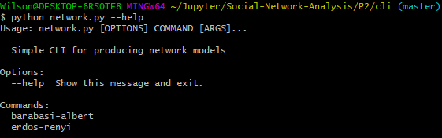
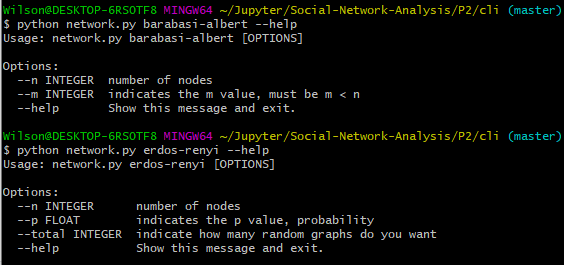
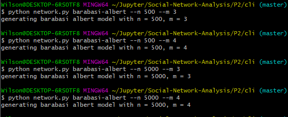

## 1. Desarrollo de modelos
- [x] 1.1 Creacion de 2 redes iguales de cada tipo
- [x] 1.2 Actualizar en cada paso de simulacion (Barabasi-Albert)
- [x] 1.3 Etapas: subcrítica p < 1/N, crítica p = 1/N, supercrítica p < 1/N y conectada p > ln(N/N).
- [x] 1.4 Cli creado para la generacion de grafos
- [x] 1.5 Manual de uso de CLI (mas abajo)
## 2. Verificacion de propiedades de las redes, segun su modelo teorico
- [ ] 2.1 Para la red de erdos-renyi calcular a media de los 10 grafos
- [x] 2.2 Visualizaciones de los pasos del modelo Barabasi-Albert
- [x] 2.3 Visualizaciones de las diferentes regiones
- [ ] 2.4 Verificar propiedades de los mismos modelos, ver diferencias entre modelos
## 3. Estudio de la red de la practica 1, Actores-Peliculas []
- [ ] 3.1 A que modelo se aproxima mas? Comparacion de ambas redes

## Manual uso de CLI
#### network.py
Ejecutamos el CLI de python desde donde queramos que se guarden los grafos generados, en este caso sera desde la subcarpeta 'graphs/'

Tenemos 2 opciones para generar modelos de grafo, barabasi-albert y erdos-renyi

Y dependiendo del modelo, unos parametros diferentes,En Barabasi Albert tenemos dos parametros numero de nodos (ej --n 500) y el valor de nodos iniciales m (ej --m 3)

Erdos Renyi tendremos el numero de nodos (ej --n 500) probabilidad (ej --p 0.001) y el numero total de grafos a generar (ej --total 10)

En ambos podemos no especificar nada y se generara un grafo con sus parametros por defecto, (n=500, m=3, p=0.001 y total=1)

## ---- Entregar ----

- codigo fuente

- ejecutable

- redes de los modelos

- manual de uso de la aplicacion creada

- documentacion en pdf

    - Portada con el número y título de la práctica.

    - Número de grupo.
    
    - Nombre y apellidos de los integrantes del grupo.
    
    - Análisis comparativo de las redes generadas con los modelos.
    
    - Análisis del modelo de red más adecuado para la red de la práctica 1.
    
    - Referencias bibliográficas u otro tipo de material distinto del proporcionado en la asignatura que se haya consultado para realizar la práctica.
